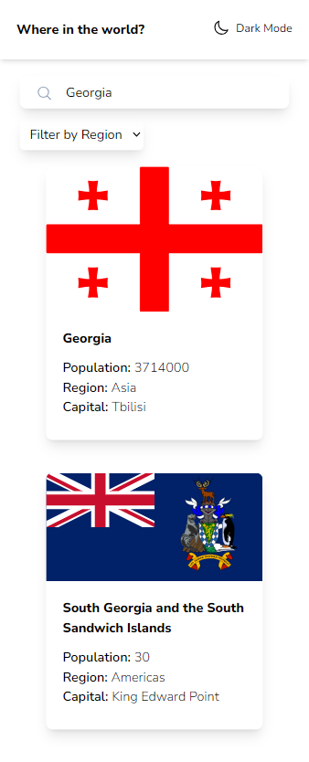
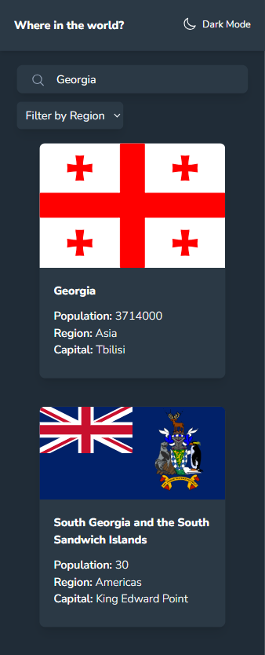
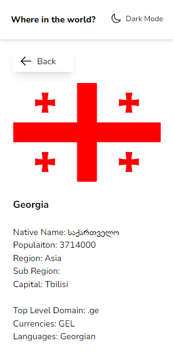
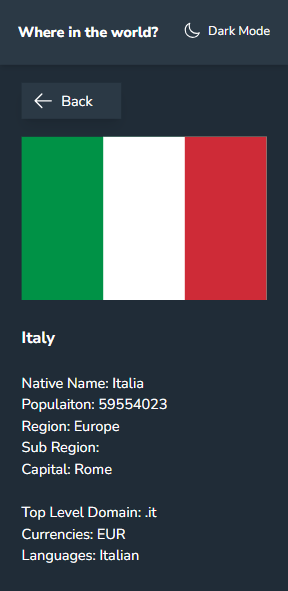
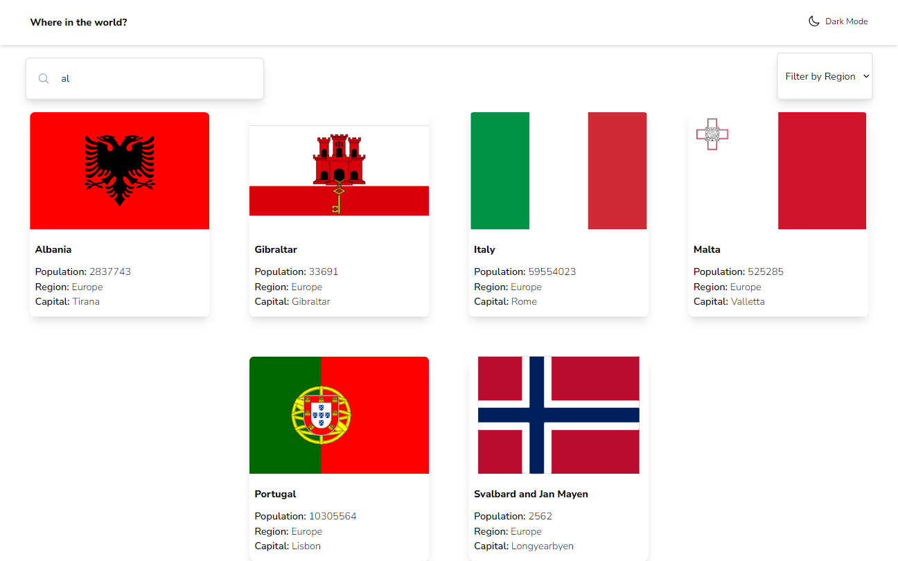
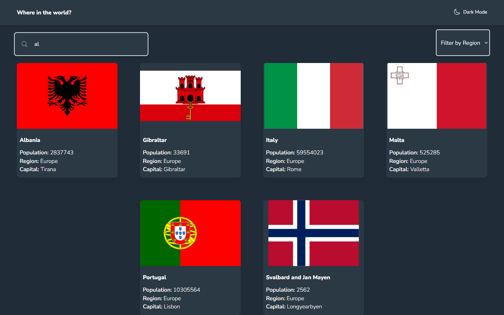

# Frontend Mentor - REST Countries API with color theme switcher solution

This is a solution to the [REST Countries API with color theme switcher challenge on Frontend Mentor](https://www.frontendmentor.io/challenges/rest-countries-api-with-color-theme-switcher-5cacc469fec04111f7b848ca). Frontend Mentor challenges help you improve your coding skills by building realistic projects.

## Table of contents

- [Overview](#overview)
  - [The challenge](#the-challenge)
  - [Screenshot](#screenshot)
  - [Links](#links)
- [My process](#my-process)
  - [Built with](#built-with)
  - [What I learned](#what-i-learned)
  - [Continued development](#continued-development)
  - [Useful resources](#useful-resources)
- [Author](#author)

## Overview

### The challenge

Users should be able to:

- See all countries from the API on the homepage (API have limited fetch I created json DATA of the fetched data)
- Search for a country using an `input` field
- Filter countries by region
- Click on a country to see more detailed information on a separate page
- Click through to the border countries on the detail page
- Toggle the color scheme between light and dark mode

### Screenshot

-See all countries on the homepage 
-See all countries on the homepage Dark Mode 
-Click a country to see detailed information on a seperate page 
-Detailed info dark mode 
-Desktop version of all countries 
-Desktop version of all countries dark mode 

### Links

- Live Site URL: [Add live site URL here](No url yet)

## My process

### Built with

- Semantic HTML5 markup
- CSS custom properties
- Flexbox
- CSS Grid
- Mobile-first workflow
- [React](https://reactjs.org/) - JS library
- [Next.js](https://nextjs.org/) - React framework
- [TailwindCSS](https://tailwindcss.com/) - For styles

### What I learned

- React hooks
- UseEffect
- UseState
- Re-render page

### Continued development

-Resolve typescript issues

### Useful resources

- [Dark mode use](https://www.youtube.com/watch?v=VylXkPy-MIc) How to use dark mode

## Author

- Linkedin - [Nika Merabishvili](https://www.linkedin.com/in/nikusha-merabishvili/)
